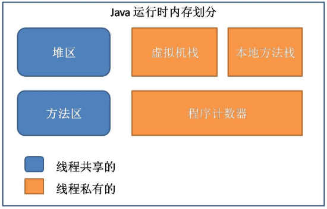

# 目录
- [程序计数器(Program Counter Register)](#程序计数器program-counter-register)
- [虚拟机栈(JVM Stack)](#虚拟机栈jvm-stack)
- [本地方法栈(Native Method Statck)](#本地方法栈native-method-statck)
- [堆区(Heap)](#堆区heap)
- [方法区(Method Area)](#方法区method-area)
- [运行时常量池(Runtime Constant Pool)](#运行时常量池runtime-constant-pool)

<!-- = = = = = = = = = = = = = = = = = = = = = = = = = = = = = = = = = = = = = = = = = = = = = = = = = = = = = = = = = = = = -->
<!-- = = = = = = = = = = = = = = = = = = = = = = = = = = = = = = = = = = = = = = = = = = = = = = = = = = = = = = = = = = = = -->

# 程序计数器(Program Counter Register)
* 线程私有
* 每个程序计数器只用来记录一个线程的行号, 用于指示当前线程所执行的字节码执行到了第几行, 可以理解为是当前线程的行号指示器
* 如果程序执行的是一个Java方法, 计数器记录的是正在执行的虚拟机字节码指令地址
* 如果正在执行的是一个本地方法, 则计数器的值为Undefined
* 由于程序计数器只是记录当前指令地址, 所以不存在内存溢出的情况, 因此, 程序计数器也是所有JVM内存区域中唯一一个没有定义OutOfMemoryError的区域

<!-- = = = = = = = = = = = = = = = = = = = = = = = = = = = = = = = = = = = = = = = = = = = = = = = = = = = = = = = = = = = = -->
<!-- = = = = = = = = = = = = = = = = = = = = = = = = = = = = = = = = = = = = = = = = = = = = = = = = = = = = = = = = = = = = -->

# 虚拟机栈(JVM Stack)
* 线程私有
* 每个线程对应着一个虚拟机栈, 方法运行所需要分配的空间在栈帧中是完全确定的, 在方法的生命周期内都不会改变
* 线程的每个方法对应一个栈帧. 一个线程的每个方法在执行的同时, 都会创建一个栈帧, 栈帧中存储的有局部变量表、操作站、动态链接、方法出口等. 当方法被调用时, 栈帧在JVM栈中入栈, 当方法执行完成时, 栈帧出栈
* 局部变量表中存储着方法的相关局部变量, 包括各种基本数据类型, 对象的引用, 返回地址等. 在局部变量表中, 只有long和double类型会占用2个局部变量空间(Slot, 对于32位机器, 一个Slot就是32个bit), 其它都是1个Slot
* 如果线程调用的栈深度大于虚拟机允许的最大深度, 则抛出StatckOverFlowError(栈溢出)
* 线程可以一直申请栈, 直到内存不足, 此时, 会抛出OutOfMemoryError(内存溢出)

<!-- = = = = = = = = = = = = = = = = = = = = = = = = = = = = = = = = = = = = = = = = = = = = = = = = = = = = = = = = = = = = -->
<!-- = = = = = = = = = = = = = = = = = = = = = = = = = = = = = = = = = = = = = = = = = = = = = = = = = = = = = = = = = = = = -->

# 本地方法栈(Native Method Statck)
* 线程私有
* 本地方法栈在作用, 运行机制, 异常类型等方面都与虚拟机栈相同
* 唯一的区别是：虚拟机栈是执行Java方法的, 而本地方法栈是用来执行native方法的, 在很多虚拟机中会将本地方法栈与虚拟机栈放在一起使用

<!-- = = = = = = = = = = = = = = = = = = = = = = = = = = = = = = = = = = = = = = = = = = = = = = = = = = = = = = = = = = = = -->
<!-- = = = = = = = = = = = = = = = = = = = = = = = = = = = = = = = = = = = = = = = = = = = = = = = = = = = = = = = = = = = = -->

# 堆区(Heap)
* 线程共享 逻辑连续 可固定可扩展
* 堆区是最大的一块, 堆区也是Java GC机制所管理的主要内存区域, 在虚拟机启动时创建
* 堆区的存在是为了存储对象实例与数值组, 原则上讲, 所有的对象都在堆区上分配内存
* 堆内存需要在逻辑上是连续的(在物理上不需要), 在实现时, 可以是固定大小的, 也可以是可扩展的, 目前主流的虚拟机都是可扩展的
* 如果在执行垃圾回收之后, 仍没有足够的内存分配, 也不能再扩展, 将会抛出OutOfMemoryError异常

<!-- = = = = = = = = = = = = = = = = = = = = = = = = = = = = = = = = = = = = = = = = = = = = = = = = = = = = = = = = = = = = -->
<!-- = = = = = = = = = = = = = = = = = = = = = = = = = = = = = = = = = = = = = = = = = = = = = = = = = = = = = = = = = = = = -->

# 方法区(Method Area)
* 线程共享 逻辑连续 可固定可扩展
* 用于存储已经被虚拟机加载的类信息(即加载类时需要加载的信息, 包括版本、field、方法、接口等信息)、final常量、static变量、编译器即时编译的代码等
* 可以选择是否执行垃圾收集, 方法区上执行的垃圾收集是很少的, 其上的垃圾收集主要是针对常量池的内存回收和对已加载类的卸载
* 在方法区上定义了OutOfMemoryError:PermGen space异常, 在内存不足时抛出
* 永久代的回收有两种：常量池中的常量, 无用的类信息

<!-- = = = = = = = = = = = = = = = = = = = = = = = = = = = = = = = = = = = = = = = = = = = = = = = = = = = = = = = = = = = = -->
<!-- = = = = = = = = = = = = = = = = = = = = = = = = = = = = = = = = = = = = = = = = = = = = = = = = = = = = = = = = = = = = -->

# 运行时常量池(Runtime Constant Pool)
* 是方法区的一部分, 用于存储编译期就生成的字面常量、符号引用、翻译出来的直接引用(符号引用就是编码是用字符串表示某个变量、接口的位置, 直接引用就是根据符号引用翻译出来的地址, 将在类链接阶段完成翻译)；运行时常量池除了存储编译期常量外, 也可以存储在运行时间产生的常量(比如String类的intern()方法, 作用是String维护了一个常量池, 如果调用的字符“abc”已经在常量池中, 则返回池中的字符串地址, 否则, 新建一个常量加入池中, 并返回地址)
    * 对于==，如果作用于基本数据类型的变量，则直接比较其存储的 “值”是否相等；如果作用于引用类型的变量，则比较的是所指向的对象的地址
    * 对于equals方法，注意：equals方法不能作用于基本数据类型的变量。如果没有对equals方法进行重写，则比较的是引用类型的变量所指向的对象的地址；诸如String、Date等类对equals方法进行了重写的话，比较的是所指向的对象的内容
