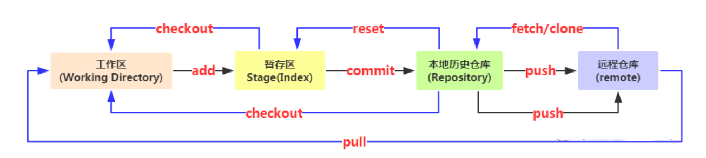

# 目录
- [初始配置](#初始配置)
- [日志](#日志)
- [撤销](#撤销)
    - [版本回退](#版本回退)
    - [文件回退](#文件回退)
    - [其他](#其他)
- [分支](#分支)
    - [新建与删除分支](#新建与删除分支)
    - [切换分支](#切换分支)
    - [合并分支](#合并分支)
- [远程](#远程)
    - [远程分支](#远程分支)
- [储存现场](#储存现场)
- [标签](#标签)
- [底层命令](#底层命令)


<!-- = = = = = = = = = = = = = = = = = = = = = = = = = = = = = = = = = = = = = = = = = = = = = = = = = = = = = = = = = = = = -->
<!-- = = = = = = = = = = = = = = = = = = = = = = = = = = = = = = = = = = = = = = = = = = = = = = = = = = = = = = = = = = = = -->


# 初始配置
```sh
# name会在 git log 中显示
git config --global user.name NAME
git config --global user.email ENAIL ADDRESS
```
```sh
# 查看配置
git config --list
```


<!-- = = = = = = = = = = = = = = = = = = = = = = = = = = = = = = = = = = = = = = = = = = = = = = = = = = = = = = = = = = = = -->
<!-- = = = = = = = = = = = = = = = = = = = = = = = = = = = = = = = = = = = = = = = = = = = = = = = = = = = = = = = = = = = = -->


# 日志
* **`git log`** 查看最近三次的提交
* **`git log --oneline --all --graph`** 查看分支图
* **`git reflog`** 查看所有历史日志


<!-- = = = = = = = = = = = = = = = = = = = = = = = = = = = = = = = = = = = = = = = = = = = = = = = = = = = = = = = = = = = = -->
<!-- = = = = = = = = = = = = = = = = = = = = = = = = = = = = = = = = = = = = = = = = = = = = = = = = = = = = = = = = = = = = -->


# 撤销
### 版本回退
* **回退到上一个版本** `git reset [--hard | --mixed | --soft] HEAD^`
* **回退到指定版本** `git reset [--hard | --mixed | --soft] <COMMIT_ID>`
* **说明**
    * `--soft` 不修改working directory和index, 只修改**HEAD**的内容. 本质上是撤销了上一次的commit命令
    * `--mixed` 不修改working directory, 只修改**index**和**HEAD**的内容
    * `--hard` 修改**working directory**和**index**和**HEAD**的内容

### 文件回退
* **Modified -> Unmodified:** 撤销尚未提交到暂存区的修改
    * `git checkout -- <file>`
    * `git restore <FILE>`
* **Staged -> Modified:** 可以把提交到暂存区的修改unstaged(撤销)
    * `git reset HEAD <file>`
    * `git restore --staged <FILE>`
* **Unmodified -> Untracked:** 删除一个文件
    * `git rm <file>`
* **Staged -> Untracked:** 取消追踪已追踪文件
    * `git rm [-r] --cached <file>`



### 其他
* 修改提交信息 `git commit --amend`


<!-- = = = = = = = = = = = = = = = = = = = = = = = = = = = = = = = = = = = = = = = = = = = = = = = = = = = = = = = = = = = = -->
<!-- = = = = = = = = = = = = = = = = = = = = = = = = = = = = = = = = = = = = = = = = = = = = = = = = = = = = = = = = = = = = -->


# 分支
### 新建与删除分支
* **`git branch`** 查看所有分支
* **`git branch <BRANCH_NAME> [COMMIT_HASH]`** 新建一个分支并使分支指向对应的提交对象, 默认为当前分支
* **`git branch -d <BRANCH_NAME>`** 删除 一个已合并的分支
* **`git branch -D <BRANCH_NAME>`** 强制删除一个未合并的分支

### 切换分支
* **`git checkout <BRANCH_NAME | TAG_NAME>`** 切换分支
* **`git checkout -b <name>`** 创建并切换到创建的分支

### 合并分支
* **`git merge <name>`** 合并某分支到当前分支
* **`git merge --no-ff [-m message] <name>`** --no-ff参数, 表示禁用 **Fast forward** 模式


<!-- = = = = = = = = = = = = = = = = = = = = = = = = = = = = = = = = = = = = = = = = = = = = = = = = = = = = = = = = = = = = -->
<!-- = = = = = = = = = = = = = = = = = = = = = = = = = = = = = = = = = = = = = = = = = = = = = = = = = = = = = = = = = = = = -->


# 远程
* **`git remote add <repository name> <SSH | HTTPS>`** 使本地仓库与远程仓库关联
* **`git clone <SSH | HTTPS>`** 克隆一个远程仓库
* **`git pull origin <REMOTE_BRANCH_NAME>`** 更新代码
* **`git remote -v`** 查看远程仓库信息

### 远程分支
* **`git branch -vv`** 查看分支详细信息
* **`git branch --set-upstream-to=origin/dev dev`** 将本地已有的分支和远程已有的分支关联起来
* **`git push -u origin master`** 把本地仓库推送给远程仓库. 加上-u参数会把本地的master分支和远程master分支关联
* **`git push origin --delete <remote-branch-name>`** 删除远程分支
* **`git remote prune origin --dry-rnu`** 列出仍在跟踪但远程已删除的分支


<!-- = = = = = = = = = = = = = = = = = = = = = = = = = = = = = = = = = = = = = = = = = = = = = = = = = = = = = = = = = = = = -->
<!-- = = = = = = = = = = = = = = = = = = = = = = = = = = = = = = = = = = = = = = = = = = = = = = = = = = = = = = = = = = = = -->


# 储存现场
* **`git stach`** 储藏工作现场
* **`git stash list`** 查看所有的储存现场
* **`git stash apply`** 恢复现场, 不删除stash
* **`git stash pop`** 恢复现场, 并删除stash
* **`git stash drop`** 删除stach


<!-- = = = = = = = = = = = = = = = = = = = = = = = = = = = = = = = = = = = = = = = = = = = = = = = = = = = = = = = = = = = = -->
<!-- = = = = = = = = = = = = = = = = = = = = = = = = = = = = = = = = = = = = = = = = = = = = = = = = = = = = = = = = = = = = -->


# 标签
* **`git tag`** 查看所有标签
* **`git show <tag_name>`** 查看标签具体信息

<br>

* **`git tag <tag_name> [COMMIT_ID]`** 新建一个标签, 不输入版本号则默认在当前分支的最新提交
* **`git tag -a <tag_name> -m <"message"> [version]`** 指定标签信息
* **`git tag -d <tag name>`** 删除本地标签
* **`git push origin :refs/tags/<tag_name>`** 删除远程标签

<br>

* **`git push origin <tag_name>`** 推送标签到远程
* **`git push origin --tags`** 推送所有标签到远程


<!-- = = = = = = = = = = = = = = = = = = = = = = = = = = = = = = = = = = = = = = = = = = = = = = = = = = = = = = = = = = = = -->
<!-- = = = = = = = = = = = = = = = = = = = = = = = = = = = = = = = = = = = = = = = = = = = = = = = = = = = = = = = = = = = = -->


# 底层命令
* **`git hash-object -w FILE_URL`** 生成一个key:value(HashCode:压缩后的文件)存储到.git/object
* **`git update-index --add --cacheinfo 100644 hash test.txt`** 往暂存区添加一条记录
* **`git write-tree`** 生成一个tree对象存储到.git/object
* **`echo '' | git commit-tree treehash`** 生成一个commit对象

<br>

* **`git cat-file -p HASH_CODE`** 查对象的**内容**
* **`git cat-file -t HASH_CODE`** 查对象的**类型**

<br>

* **`git ls-files -s`** 查看暂存区
