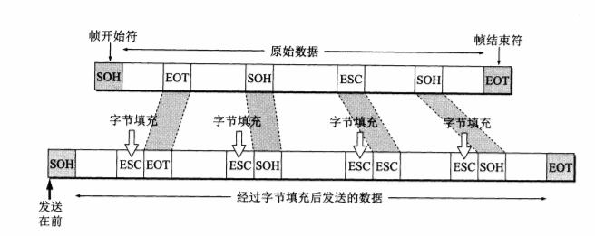
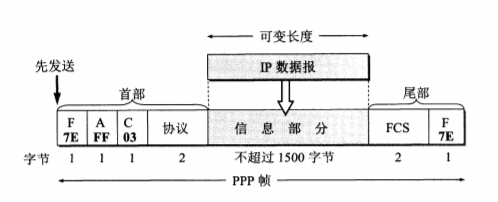
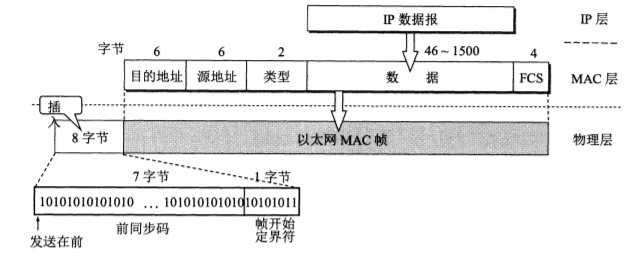
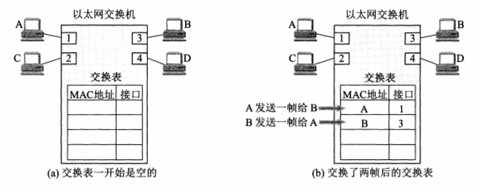

# 目录
- [概要](#概要)
    - [数据链路层使用的信道](#数据链路层使用的信道)
    - [数据链路层的三个基本问题](#数据链路层的三个基本问题)
    - [数据链路层的子层](#数据链路层的子层)
    - [其他](#其他)
- [局域网四个技术特性](#局域网四个技术特性)
- [点对点协议](#点对点协议)
    - [帧格式](#帧格式)
    - [字节填充](#字节填充)
    - [零比特填充](#零比特填充)
- [CSMA/CD](#csmacd)
    - [载波监听多点接入/碰撞检测(Carrier Sense Multiple Access with Collision Detection)](#载波监听多点接入碰撞检测carrier-sense-multiple-access-with-collision-detection)
    - [工作方式](#工作方式)
    - [截断二进制指数退避(truncated brnary exponential backoff)](#截断二进制指数退避truncated-brnary-exponential-backoff)
    - [要点归纳](#要点归纳)
- [MAC](#mac)
    - [帧格式](#帧格式-1)
- [交换机](#交换机)
    - [自学习](#自学习)

<!-- = = = = = = = = = = = = = = = = = = = = = = = = = = = = = = = = = = = = = = = = = = = = = = = = = = = = = = = = = = = = -->
<!-- = = = = = = = = = = = = = = = = = = = = = = = = = = = = = = = = = = = = = = = = = = = = = = = = = = = = = = = = = = = = -->

# 概要
### 数据链路层使用的信道
* **点对点信道(PPP协议)** 一对一的点对点通信方式
* **广播信道(CSMA/CD协议)** 一对多的广播通信方式

### 数据链路层的三个基本问题
* **封装成帧** 封装成帧(framing)就是在一段数据的前后分别添加首部和尾部, 这样就构成了一个帧
* **透明传输** 某一个实际存在的事物看起来却好像不存在一样  
  
* **差错检测** 循环冗余检验CRC(CycIic Redundancy Check)的检错技术

### 数据链路层的子层
* **逻辑链路控制 LLC(Logical Link Control)** 与传输媒体无关, 已成为历史
* **媒体访问控制 MAC(Medium Access Control)**

### 其他
* **链路(link)** 从一个结点到相邻结点的一段物理线路(有线或无线), 而中间没有任何其他的交换结点
* **数据链路(data link)** 当需要在一条线路上传送数据时, 除了必须有一条物理线路外, 还必须有一些必要的通信协议来控制这些数据的传输. 若把实现这些协议的硬件和软件加到链路上, 就构成了数据链路
* 数据链路层的**MTU是帧**

<!-- = = = = = = = = = = = = = = = = = = = = = = = = = = = = = = = = = = = = = = = = = = = = = = = = = = = = = = = = = = = = -->
<!-- = = = = = = = = = = = = = = = = = = = = = = = = = = = = = = = = = = = = = = = = = = = = = = = = = = = = = = = = = = = = -->

# 局域网四个技术特性
* **传输媒体** 双绞线, 同轴电缆
* **传输技术** 基带传输(局域网), 宽带传输
* **网络拓扑** 星型, 总线型, 环型, 数型
* **媒体访问控制方法** 信道划分, 轮询, 随机访问 

<!-- = = = = = = = = = = = = = = = = = = = = = = = = = = = = = = = = = = = = = = = = = = = = = = = = = = = = = = = = = = = = -->
<!-- = = = = = = = = = = = = = = = = = = = = = = = = = = = = = = = = = = = = = = = = = = = = = = = = = = = = = = = = = = = = -->

# 点对点协议
### 帧格式
* 第一个字段和尾部的第二个字段是标志字段F(Flag), 规定为Ox7E. 标志字段表示一个帧的开始或结束. 因此标志字段就是PPP帧的定界符, 连续两帧之间只需要用一个标志字段, 如果出现连续两个标志字段, 就表示这是一个空帧, 应当丢弃
* 首部中的地址字段A规定为OxFF, 控制字段C规定为0x03. 这两个字段实际上并没有携带PPP帧的信息
* 首部的第四个字段是2字节的协议字段. 当协议字段为Ox0021时, PPP帧的信息字段就是IP数据报. 若为0xC021, 则信息字段是PPP链路控制协议LCP的数据, 而 0x8021表示这是网络层的控制数据
* 信息字段的长度是可变的, 不超过1500字节
* 尾部中的第一个字段是使用CRC的帧检验序列FCS  

### 字节填充
当信息字段中出现和标志字段一样的比特(0x7E)组合时, 就必须采取一些措施使这种形 式上和标志字段一样的比特组合不出现在信息字段中.  当PPP使用异步传输时, 它把转义符定义为0x7D. 如下所述的填充方法:  
* 把信息字段中出现的每一个0x7E字节转变成为2字节序列(0x7D, Ox5E)
* 若信息字段中出现一个0x7D的字节(即出现了和转义字符一样的比特组合), 则 把0x7D转变成为2字节序列(0x7D, Ox5D). 
* 若信息字段中出现ASCII码的控制字符(即数值小于0x20的字符), 则在该字符前面要加入一个Ox7D字节. 例如, 出现0x03就要把它转变为2字节序列(0x7D, 0x23). 

### 零比特填充
* PPP协议用在使用 **同步传输** (一连串的比特连续传送)而不是异步传输(逐个字符地传送).在这种情况下, PPP协议采用零比特填充方法来实现透明传输. 
* 零比特填充的具体做法是: 在发送端, 先扫描整个信息字段.只要发现有5个连续l,则立即填入一个0. 因此经过这种零 比特填充后的数据, 就可以保证在信息字段中不会出现6个连续l.接收端在收到一个幀时, 先找到标志字段F以确定一个帧的边界, 接着再用硬件对其中的比特流进行扫描．每当发现5个连续1时, 就把这5个连续1后的一个0删除, 以还原成原来的信息比特流.

<!-- = = = = = = = = = = = = = = = = = = = = = = = = = = = = = = = = = = = = = = = = = = = = = = = = = = = = = = = = = = = = -->
<!-- = = = = = = = = = = = = = = = = = = = = = = = = = = = = = = = = = = = = = = = = = = = = = = = = = = = = = = = = = = = = -->

# CSMA/CD
### 载波监听多点接入/碰撞检测(Carrier Sense Multiple Access with Collision Detection)
* **多点接入** 说明这是总线型网络, 许多计算机以多点接入的方式连接在一根总线上
* **载波监听** 用电子技术检测总线上有没有其他计算机也在发送, 载波监听就是检测信道. 不管在发送前, 还是在发送中, 每个站都必须不停地检测信道
    * 在发送前检测信道, 是为了获得发送权. 如果检测出己经有其他站在发送, 则自己就暂时不许发送数据, 必须要等到信道变为空闲时才能发送
    * 在发送中检测信道, 是为了及时发现有没有其他站的发送和本站发送的碰撞
* **碰撞检测** 也就是"边发送边监听", 即适配器边发送数据边检测信道上的信号电压的变化情况, 以便判断自己在发送数据时其他站是否也在发送数据

### 工作方式
* 在使用CSMA/CD协议时, 一个站不可能同时进行发送和接收(但必须边发送边监听信道). 因此使用CSMA/CD协议的以太网不可能进行全双工通信而只能进行 **半双工通信**
* 每一个站在自己发送数据之后的一小段时间内, 存在着遭遇碰撞的可能性. 这一小段时间是不确定的, 它取决于另一个发送数据的站到本站的距离. 因此, 以太网 不能保证某一时间之内一定能够把自己的数据帧成功地发送出去(因为存在产生碰撞的可能).以太网的这一特点称为 **发送的不确定性** 
* 发送数据帧的站, 在发送数据帧后至多经过时间2t就可知道所发送的数据帧是否遭受了碰撞. 因此以太网的端到端往返时间2t为 **争用期**(contention priod), 争用期又称为 **碰撞窗口(collision window)** . 这是因为一个站在发送完数据后, 只有通过争用期的"考验", 即经过争用期这段时间还没有检测到碰撞, 才能肯定这次发送不会发生碰撞这时, 就可以放心把这一数据帧顺利发送完毕

### 截断二进制指数退避(truncated brnary exponential backoff) 
* 这种算法让发生碰撞的站在停止发送数据后, 不是等待信道变为窄闲后就立即再发送数据, 而是推迟(这叫做退避)一个随机的时间. 因为如果几个发生碰撞的站都在监听信道, 那么都会同时发现信道变成了空闲. 如果大家都同时再重新发送, 那么肯定又会发生碰撞. 为了使各站进行重传时再次发生冲突的概率减小, 具体的退避算法如下:  
    * 协议规定了基本退避时间为争用期2t. 对于10Mbit/s的以太网, 在争用期内可发送512 bit, 即64字节. 也可以说争用期是512比特时间. 1比特时间就是发送1比特所需的时间. 所以这种时间单位与数据率密切相关. 为了方便, 也可以直接使用比特作为争用期的单位. 争用期是512bit, 即争用期是发送512 bit所需的时间 
    * 从离散的整数集合[0, 1, ..., (2^k-1)]中随机取出一个数, 记为r, 重传应推后的时间就是r倍的争用期. k = Min[重传次数, 10] 
    * 当重传达16次仍不能成功时(这表明同时打算发送数据的站太多, 以致连续发生冲突), 则丢弃该帧, 并向高层报告
    * 下面介绍强化碰撞的概念. 这就是当发送数据的站一旦发现发生了碰撞时, 除了立即停止发送数据外, 还要再继续发送32比特或48比特的人为干扰信号(jamming signal), 以便 让所有用户都知道现在己经发生了碰撞. 对于10Mbit/s以太网, 发送32比特只需要3.2us 
* 例如, 在第1次重传时, k=1,随机数r从整数{0, 1}中选一个数. 因此重传的站可选 择的重传推迟时间是0或2t, 在这两个时间中随机选择一个.  
* 若再发生碰撞, 则在第2次重传时, k=2, 随机数r就从整数{0, 1, 2, 3}中选一个数.  因此重传推迟的时间是在0, 2t, 4t和6t这4个时间中随机地选取一个  
* 由此可见, 以太网在发送数据时, 如果在争用期(共发送了64字节)没有发生碰撞,  那么后续发送的数据就一定不会发生冲突. 换句话说, 如果发生碰撞, 就一定是在发送的前 64字节之内. 由于一检测到冲突就立即中止发送, 这时己经发送出去的数据一定小于64字 节．因此凡长度小于64字节的帧都是由于冲突而异常中止的无效帧. 只要收到了这种无效帧, 就应该立即丢弃掉

### 要点归纳 
* 准备发送: 适配器从网络层获得一个分组, 加上以太网的首部和尾部, 组成以太网帧, 放入适配器的缓存中. 但在发送之前, 必须先检测信道
* 检测信道: 若检测到信道忙, 则应不停地检测, 一直等待信道转为空闲. 若检测到信道空闲, 并在比特时间内信道保持空闲(保证了帧间最小间隔),就发送这个帧
* 在发送过程中仍不停地检测信道, 即网络适配器要边发送边监听, 这里只有两种可能性:  
    * 发送成功: 在争用期内一直未检测到碰撞. 这个帧肯定能够发送成功, 发送完毕后, 其他什么也不做
    * 发送失败: 在争用期内检瀏到碰撞. 这时立即停止发送数据, 并按规定发送人为干扰信号. 适配器接着就执行指数退避算法, 等待r倍512比特时间后, 继续检测信道. 但若重传达16次仍不能成功, 则停止重传面向上报错
* 以太网每发送完一帧, 一定要把己发送的帧暫时保留一下, 如果在争用期内检测出发生了碰撞, 那么还要在推迟一段时间后再把这个暫时保留的帧重传一次

<!-- = = = = = = = = = = = = = = = = = = = = = = = = = = = = = = = = = = = = = = = = = = = = = = = = = = = = = = = = = = = = -->
<!-- = = = = = = = = = = = = = = = = = = = = = = = = = = = = = = = = = = = = = = = = = = = = = = = = = = = = = = = = = = = = -->

# MAC
* 在局域网中, 硬件地址又称为物理地址或MAC地址, 48位

### 帧格式
* 前两个字段分别为6字节长的目的地址和源地址字段
* 第三个字段是2字节的类型字段, 用来标志上一层使用的是什么协议, 以便把收到的MAC帧的数据上交给上一层的这个协议
* 第四个字段是数据字段, 其长度在46到1500字节之间(46字节是这样得出的：最小长度64字节减去18字节的首部和尾部就得出数据字段的最小长度)
* 最后一个字段是4字节的帧检验序列FCS(使用CRC检验)  

<!-- = = = = = = = = = = = = = = = = = = = = = = = = = = = = = = = = = = = = = = = = = = = = = = = = = = = = = = = = = = = = -->
<!-- = = = = = = = = = = = = = = = = = = = = = = = = = = = = = = = = = = = = = = = = = = = = = = = = = = = = = = = = = = = = -->

# 交换机
### 自学习
* 假定以太网交换机有4个接口, 各连接一台计算机, 其MAC地址分别 是A, B, C和D. 在一开始, 以太网交换机里面的交换表是空的
* A先向B发送一帧, 从接01进入到交换机. 交换机收到帧后, 先查找交换表, 没有 查到应从哪个接口转发这个帧(在MAC地址这一列中, 找不到目的地址为B的项目)0接 着, 交换机把这个帧的源地址A和接口1写入交换表中, 并向除接口1以外的所有接口广 播这个帧(这个帧就是从接口1进来的, 当然不应当把它再从接口1转发出去)
* C和D将丢弃这个帧, 因为目的地址不对. 只B才收下这个目的地址正确的帧. 这也 称为过滤" 
* 从新写入交换表的项目(A, 1)可以看出, 以后不管从哪一个接口收到帧．只要其目的地 址是A,就应当把收到的帧从接口I转发出去. 这样做的依据是：既然A发出的帧是从接 口1进入到交换机的, 那么从交换机的接口I转发出的帧也应当可以到达A
* 假定接下来B通过接口3向A发送一帧. 交换机查找交换表, 发现交换表中的MAC 地址有AO表明要发送给A的帧(即目的地址为A的帧)应从接口1转发. 于是就把这个 帧传送到接口1转发给显然．现在己经没有必要再广播收到的帧. 交换表这时新增加的 项目(B, 3), 表明今后如有发送给B的帧, 就应当从接口3转发出去" 
* 经过一段时间后, 只要主机C和D也向其他主机发送帧, 以太网交换机中的交换表就 会把转发到c或D应当经过的接口号(2或4)写入到交换表中. 这样, 交换表中的项目就 齐全了. 要转发给任何一台主机的帧, 都能够很快地在交换表中找到相应的转发接口  
  
