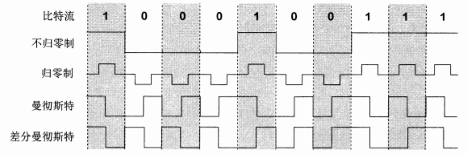
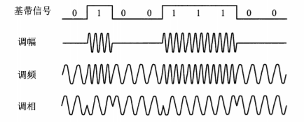
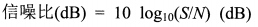
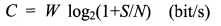
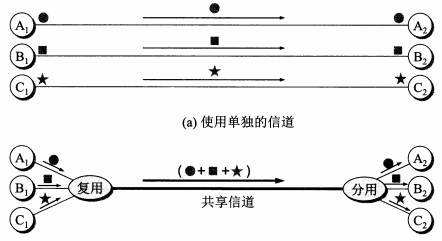
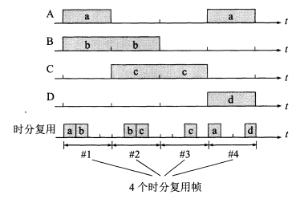
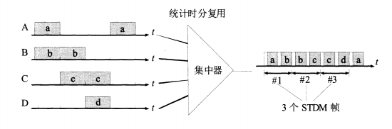
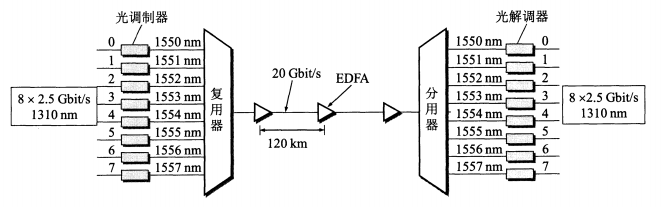

# 目录
- [调制](#调制)
- [编码方式](#编码方式)
- [带通调制方式](#带通调制方式)
- [信道的极限容量](#信道的极限容量)
        - [信噪比(dB)](#信噪比db)
        - [香农公式](#香农公式)
- [复用](#复用)
        - [频分复用FDM(Frequency Division Multiplexmg)](#频分复用fdmfrequency-division-multiplexmg)
        - [时分复用TDM (Time Division Multiplexing)](#时分复用tdm-time-division-multiplexing)
        - [统计时分复用STDM(Statistic TDM)](#统计时分复用stdmstatistic-tdm)
        - [波分复用WDM(Wavelength Division Multiplexing)](#波分复用wdmwavelength-division-multiplexing)
        - [码分复用CDM(Code Division Muluplexmg)](#码分复用cdmcode-division-muluplexmg)
- [差错控制](#差错控制)
        - [分类](#分类)

<!-- = = = = = = = = = = = = = = = = = = = = = = = = = = = = = = = = = = = = = = = = = = = = = = = = = = = = = = = = = = = = -->
<!-- = = = = = = = = = = = = = = = = = = = = = = = = = = = = = = = = = = = = = = = = = = = = = = = = = = = = = = = = = = = = -->

# 调制
来自信源的信号常称为**基带信号**(基本频带信号). 像计算机输出的代表各种文字或图像文件的数据信号都属于基带信号. 基带信号往往包含有较多的低频成分, 甚至有直流成分, 而许多信道并不能传输这种低频分量或直流分量. 为了解决这一问题, 就必须对基带信号进行**调制**(modulation)  
**调制**可分为两大类:
* **基带调制(编码)** 仅仅对基带信号的**波形进行变换**, 使它能够与信道特性相适应. 变换后的信号仍然是**基带信号**. 这类调制称为**基带调制**. 由于这种基带调制是把数字信号转换为另一种形式的**数字信号**, 因此这种过程也称为**编码(coding)**
* **带通调制** 则需要使用**载波(carrier)**进行调制, 把基带信号的频率范围撮移到较高的频段, 并转换为**模拟信号**, 这样就能够史好地在模拟信道中传输. 经过载波调制后的信号称为**带通信号**(即仅在一段频率范围内能够通过信道), 而使用载波的调制称为**带通调制**

<!-- = = = = = = = = = = = = = = = = = = = = = = = = = = = = = = = = = = = = = = = = = = = = = = = = = = = = = = = = = = = = -->
<!-- = = = = = = = = = = = = = = = = = = = = = = = = = = = = = = = = = = = = = = = = = = = = = = = = = = = = = = = = = = = = -->

# 编码方式
* **不归零制** 正电平代表1
* **归零制** 正脉冲代表1
* **曼彻斯特编码** 周期中心向下跳代表1
* **差分曼彻斯特编码** 周期中心始终有跳变, 开始边界没有跳变代表1

<!-- = = = = = = = = = = = = = = = = = = = = = = = = = = = = = = = = = = = = = = = = = = = = = = = = = = = = = = = = = = = = -->
<!-- = = = = = = = = = = = = = = = = = = = = = = = = = = = = = = = = = = = = = = = = = = = = = = = = = = = = = = = = = = = = -->

# 带通调制方式
* **调幅(AM)** 载波的**振幅**随基带数字信号变化而变化. 例如0和1分别对应有载波和无载波输出
* **调频(FM)** 载波的**频率**随基带数字信号变化而变化. 例如0和1分别对应不同频率
* **调相(PM)** 载波的**初始相位**随基带数字信号变化而变化. 例如0和1分别对应不同初始相位

<!-- = = = = = = = = = = = = = = = = = = = = = = = = = = = = = = = = = = = = = = = = = = = = = = = = = = = = = = = = = = = = -->
<!-- = = = = = = = = = = = = = = = = = = = = = = = = = = = = = = = = = = = = = = = = = = = = = = = = = = = = = = = = = = = = -->

# 信道的极限容量
### 信噪比(dB)  

* **S** 信号平均功率
* **N** 噪声平均功率

### 香农公式  

* **C(bit/s)** 信道的极限信息传输速率 
* **W(Hz)** 信道的宽度
* **S** 信号平均功率
* **N** 噪声平均功率

<!-- = = = = = = = = = = = = = = = = = = = = = = = = = = = = = = = = = = = = = = = = = = = = = = = = = = = = = = = = = = = = -->
<!-- = = = = = = = = = = = = = = = = = = = = = = = = = = = = = = = = = = = = = = = = = = = = = = = = = = = = = = = = = = = = -->

# 复用
### 频分复用FDM(Frequency Division Multiplexmg)
用户在分配到定的频带后, 在通信过程中自始至终都占用这个频带. 频分复用的所有用户在**同样的时间占用不同的带宽资源**

### 时分复用TDM (Time Division Multiplexing)
将时间划分为一段段等长的**时分复用帧(TDM帧)**. 每一个时分复用的用户在每一个TDM帧中占用固定序号的时隙. 每一个用户所占用的时隙周期性地出现(其周期就是TDM帧的长度). 因此 TDM信号也称为等时(isochronous)信号. 可以看出, 时分复用的所有用户是在**不同的时间占用同样的频带宽度**  

### 统计时分复用STDM(Statistic TDM)
统计时分复用使用**STDM帧**来传送复用的数据. 但每一个STDM帧中的时隙数小于连接在集中器上的用户数.  在输出线路上, 某一个用户所占用的时隙并不是周期性地出现  

### 波分复用WDM(Wavelength Division Multiplexing)
波分复用就是光的頻分复用. 由于光载波的频率很高, 因此习惯上用波长而不用频率来表示所使用的光载波. 这样就得出了**波分复用**这一名词  

### 码分复用CDM(Code Division Muluplexmg)
也叫**码分多址CDMA(Code Division Multiple Access)**. 在CDMA中, 每一个**比特时间**再划分为m个短的间隔, 称为码片(chip)  
使用CDMA的每一个站被指派一个唯一的m bit码片序列(chip sequence). 一个站如果要发送比特1, 则发送它自己的m bit码片序列. 如果要发送比特0, 则发送该码片序列的二进制反码. 例如, 指派给S站的8bit码片序列是00011011. 当S发送比特1时, 它就发送序列00011011, 而当S发送比特0时, 就发送11100100. 为了方便, 按惯例将码片中的0写为-1, 将1写为+1. 因此S站的码片序列是(-1-1-1+1+1-1+1+1)  
* 共有4个站进行码分多址 4个站的码片序列为
    * A (-1-1-1+1+1-1+1+1)
    * B (-1-1+1-1+1+1+1-1)
    * C (-1+1-1+1+1+1-1-1)
    * D (-1+1-1-1-1-1+1-1)
* 现收到这样的码片序列S (-1+1-3+1-1-3+1+1)
    * S•A=(＋1－1＋3＋1－1＋3＋1＋1)/8=1  A发送1
    * S•B=-1 B发送0
    * S•C=0  C无发送
    * S•D=1  D发送1

<!-- = = = = = = = = = = = = = = = = = = = = = = = = = = = = = = = = = = = = = = = = = = = = = = = = = = = = = = = = = = = = -->
<!-- = = = = = = = = = = = = = = = = = = = = = = = = = = = = = = = = = = = = = = = = = = = = = = = = = = = = = = = = = = = = -->

# 差错控制
### 分类
* **检错码**
    - **奇偶校验码** 数据中包含奇数(或偶数)个1
    - **循环荣誉码(CRC)** 
* **纠错码**
    - **海明码**
