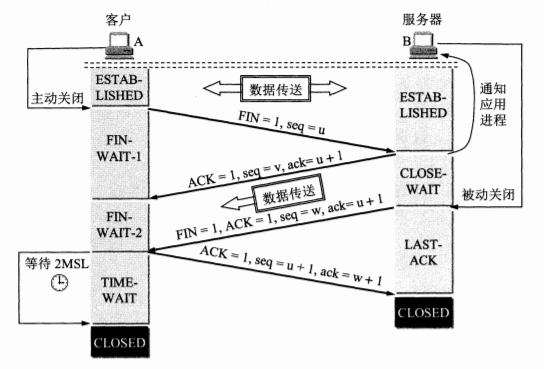

# 运输层

*********************************************************************

# TCP
* 第一次握手: Client将标志位SYN置为1, 随机产生一个值seq=J, 并将该数据包发送给Server, Client进入SYN_SENT状态, 等待Server确认
* 第二次握手: Server收到数据包后由标志位SYN=1知道Client请求建立连接, Server将标志位SYN和ACK都置为1, ack (number )=J+1, 随机产生一个值seq=K, 并将该数据包发送给Client以确认连接请求, Server进入SYN_RCVD状态
* 第三次握手: Client收到确认后, 检查ack是否为J+1, ACK是否为1, 如果正确则将标志位ACK置为1, ack=K+1, 并将该数据包发送给Server, Server检查ack是否为K+1, ACK是否为1, 如果正确则连接建立成功, Client和Server进入ESTABLISHED状态, 完成三次握手, 随后Client与Server之间可以开始传输数据了

 

* 第一次挥手: Client发送一个FIN, 用来关闭Client到Server的数据传送, Client进入FIN_WAIT_1状态
* 第二次挥手: Server收到FIN后, 发送一个ACK给Client, 确认序号为收到序号+1(与SYN相同, 一个FIN占用一个序号), Server进入CLOSE_WAIT状态
* 第三次挥手: Server发送一个FIN, 用来关闭Server到Client的数据传送, Server进入LAST_ACK状态
* 第四次挥手: Client收到FIN后, Client进入TIME_WAIT状态, 接着发送一个ACK给Server, 确认序号为收到序号+1, Server进入CLOSED状态, 完成四次挥手

 

* 为什么A还要发送一次确认呢？这主要是为了防止己失效的连接请求报文段突然又传 送到了B, 因而产生错误. 
* 所谓"己失效的连接请求报文段"是这样产生的. 考虑一种正常情况. A发出连接请 求, 但因连接请求报文去失而未收到确认. 于是A再重传一次连接请求. 后来收到了确认, 建立了连接. 数据传输完毕后, 就释放了连接. A共发送了两个连接请求报文段, 其中第一个丢失, 第二个到达了B. 没有"己失效的连接请求报文段"  
* 现假定出现一种异常情况, 即A发出的第一个连接请求报文段并没有丢失, 而是在某些网络结点长时间滯留了, 以致延误到连接释放以后的某个时间才到达B. 本来这是一个早己失效的报文段. 但B收到此失效的连接请求报文段后, 就误认为是A又发出一次新的连接请求. 于是就向A发出确认报文段, 同意建立连接. 假定不采用三次握手, 那么只要B 发出确认, 新的连接就建立了
* 由于现在A并没有发出建立连接的请求, 因此不会理睬B的确认, 也不会向B发送数据. 但B却以为新的运输连接己经建立了, 并一直等待A发来数据. B的许多资源就这样 白白浪费了
* 采用三次握手的办法可以防止上述现象的发生. 例如在刚才的情况下, A不会向B的确认发出确认. B由于收不到确认, 就知道A并没有要求建立连接

# TCP和UDP
面向连接 可靠   面向字节流 全双工 拥塞控制 首部20字节
无连接   不可靠 面向报文  首部8字节 
