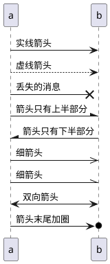
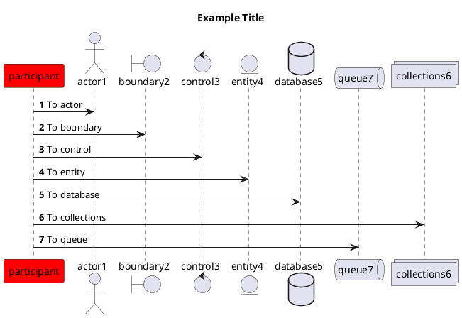

# 安装
* 要求有java
* 下载graphviz `sudo apt install graphviz`
* 下载plantUML [https://plantuml.com/zh/download](https://plantuml.com/zh/download)
* vscode集成: 安装 **plantUML** 插件, 并在settings.json加入下面的内容
    - 修改Render为`PlantUMLServer`
    - 修改Server为`http://www.plantuml.com/plantuml`

# 箭头
* 实线箭头 `->` `<-`
* 虚线箭头 `-->` `<--`
* 表示丢失的消息 `->x`
* 让箭头只有上半部分或者下半部分 `-\` `/-`
* 细箭头 `->> -\\`
* 双向箭头 `<->`
* 箭头末尾加圈 `->o`

# 时序图
### 参与者
* participant(参与者, 默认)
* actor(角色)
* boundary(边界)
* control(控制)
* entity(实体)
* database(数据库)
* collections(集合)
* queue(队列)

# 其他
* 增加标题 `title`
* 自动对消息编号 `autonumber`
* 给自己发消息 `用户 -> 用户: 登录操作`
* 让响应信息显示在箭头下面 `skinparam responseMessageBelowArrow true`
* 把一张图分割成多张 `newpage`
