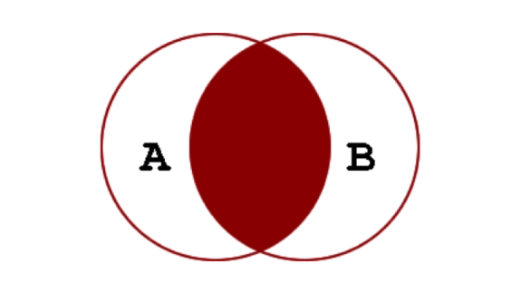
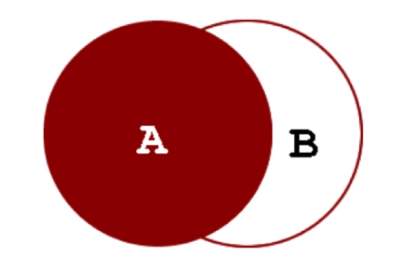
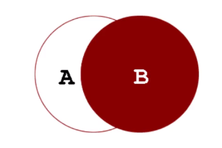

# 连接
> 在MySQL中, JOIN, CROSS JOIN和INNER JOIN是等价的  
> 通常使用ON关键字来设定连接条件  
> 使用WHERE关键字进行结果集记录的过滤  

* INNER JOIN 内连接
* LEFT [OUTER] JOIN, 左外连接
* RIGHT [OUTER] JOIN, 右外连接
```sql
{ [INNER | CROSS] JOIN | {LEFT | RIGHT} [OUTER] JOIN } 
table_reference 
ON conditional_expr 
```

###### 内连接
```sql
SELECT goods_id,goods_name,cate_name FROM tdb_goods INNER JOIN tdb_goods_cates ON tdb_goods.cate_id = tdb_goods_cates.cate_id;
 
 SELECT goods_id,goods_name,cate_name FROM tdb_goods AS a INNER JOIN tdb_goods_cates AS b ON a.cate_id = b.cate_id;
```


###### 左外连接
```sql
SELECT goods_id,goods_name,cate_name FROM tdb_goods LEFT JOIN tdb_goods_cates ON tdb_goods.cate_id = tdb_goods_cates.cate_id;
```
```sql
# 自身连接 子类所对应的父类 右边的为父表
SELECT s.type_id,s.type_name,p.type_name FROM tdb_goods_types AS s 
LEFT JOIN tdb_goods_types AS p ON s.parent_id = p.type_id;
```
```sql
# 自身连接 父类下的所有子类 左边的为父表
SELECT p.type_id,p.type_name,s.type_name FROM tdb_goods_types AS p
LEFT JOIN tdb_goods_types AS s ON s.parent_id = p.type_id;
```


###### 右外连接


###### 多表连接
```sql
SELECT goods_id,goods_name,cate_name,brand_name,goods_price FROM tdb_goods AS g
INNER JOIN tdb_goods_cates AS c ON g.cate_id = c.cate_id
INNER JOIN tdb_goods_brands AS b ON g.brand_id = b.brand_id;
```
