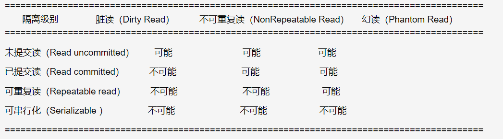
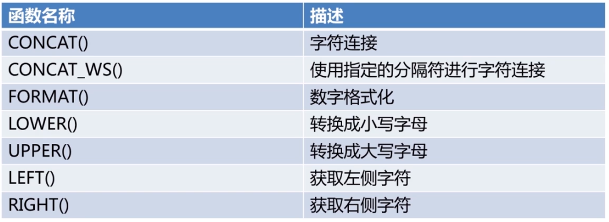
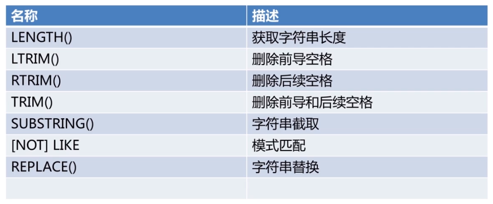
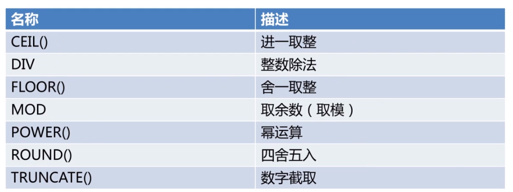
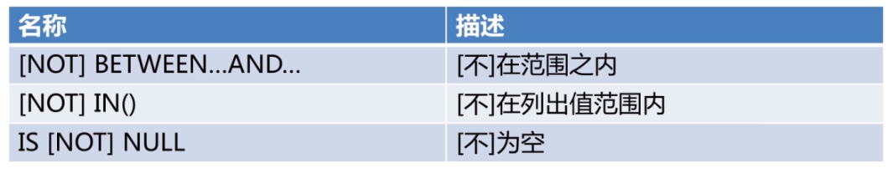
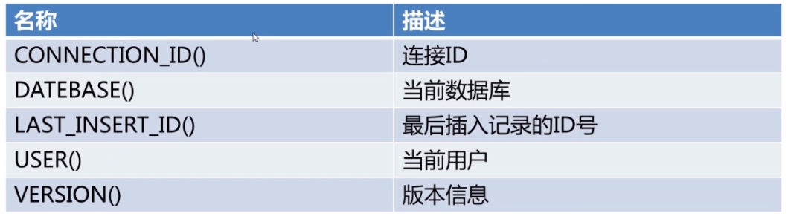
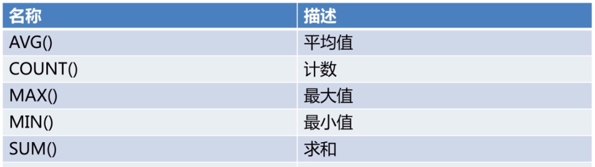
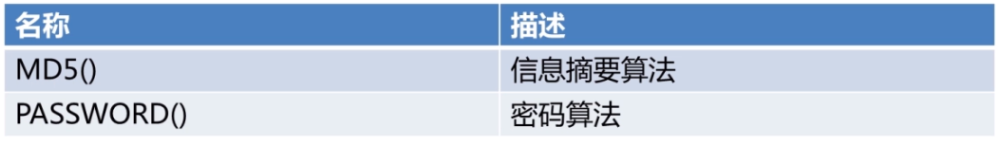

# 目录
- [ACID](#acid)
- [隔离级别](#隔离级别)
    - [未提交读(read uncommitted)](#未提交读read-uncommitted)
    - [已提交读(read committed)](#已提交读read-committed)
    - [可重复读(repeatable read)](#可重复读repeatable-read)
    - [可串行化(serializable)](#可串行化serializable)
- [提示符](#提示符)
- [数据类型](#数据类型)
- [存储过程](#存储过程)
    - [过程体](#过程体)
    - [调用存储过程](#调用存储过程)
- [函数](#函数)
    - [字符函数](#字符函数)
    - [数值运算符与函数](#数值运算符与函数)
    - [比较运算符和函数](#比较运算符和函数)
    - [日期时间函数](#日期时间函数)
    - [信息函数](#信息函数)
    - [聚合函数](#聚合函数)
    - [加密函数](#加密函数)


<!-- = = = = = = = = = = = = = = = = = = = = = = = = = = = = = = = = = = = = = = = = = = = = = = = = = = = = = = = = = = = = -->
<!-- = = = = = = = = = = = = = = = = = = = = = = = = = = = = = = = = = = = = = = = = = = = = = = = = = = = = = = = = = = = = -->


# ACID
* **`Atomicity(原子性):`** 一个事务(transaction)中的所有操作, 或者全部完成, 或者全部不完成, 不会结束在中间某个环节. 事务在执行过程中发生错误, 会被恢复(Rollback)到事务开始前的状态, 就像这个事务从来没有执行过一样. 即, 事务不可分割、不可约简
* **`Consistency(一致性):`** 在事务开始之前和事务结束以后, 数据库的完整性没有被破坏. 这表示写入的资料必须完全符合所有的预设约束、触发器、级联回滚等. 
* **`Isolation(隔离性):`** 数据库允许多个并发事务同时对其数据进行读写和修改的能力, 隔离性可以防止多个事务并发执行时由于交叉执行而导致数据的不一致. 事务隔离分为不同级别, 包括读未提交(Read uncommitted)、读提交(read committed)、可重复读(repeatable read)和串行化(Serializable)
* **`Durability(持久性):`** 事务处理结束后, 对数据的修改就是永久的, 即便系统故障也不会丢失


<!-- = = = = = = = = = = = = = = = = = = = = = = = = = = = = = = = = = = = = = = = = = = = = = = = = = = = = = = = = = = = = -->
<!-- = = = = = = = = = = = = = = = = = = = = = = = = = = = = = = = = = = = = = = = = = = = = = = = = = = = = = = = = = = = = -->


# 隔离级别
### 未提交读(read uncommitted)
A修改了数据之后, 即使未提交, B读取到的数据都是修改的数据. 如果A撤销操作, B读到的就是错误的数据  
B读到A未提交的数据, 产生了**脏读**  
```sql
SET SESSION TRANSACTION ISOLATION LEVEL read committed;
start transaction;
.....
commit;
```

### 已提交读(read committed)
解决**脏读**  
A修改数据但未提交, B只能读取提交的数据, 读不到已修改的数据  
B读到了A提交前和提交后的数据, 不一致. 产生了**不可重复读**  

### 可重复读(repeatable read)
解决**不可重复读**
每次读取的结果都相同, 不管其他事物是否已提交  

### 可串行化(serializable)
只能有一个人操作, 其他操作将被挂起  



<!-- = = = = = = = = = = = = = = = = = = = = = = = = = = = = = = = = = = = = = = = = = = = = = = = = = = = = = = = = = = = = -->
<!-- = = = = = = = = = = = = = = = = = = = = = = = = = = = = = = = = = = = = = = = = = = = = = = = = = = = = = = = = = = = = -->


# 提示符
* \D 完整的日期
* \d 当前数据库
* \h 服务器名称
* \u 当前用户
```sh
# 登入MySQL之前
$ mysql -u ... --prompt <命令提示符>

# 登入MySQL之后
$ prompt <命令提示符>
$ prompt <\u@\h \d>
```


<!-- = = = = = = = = = = = = = = = = = = = = = = = = = = = = = = = = = = = = = = = = = = = = = = = = = = = = = = = = = = = = -->
<!-- = = = = = = = = = = = = = = = = = = = = = = = = = = = = = = = = = = = = = = = = = = = = = = = = = = = = = = = = = = = = -->


# 数据类型

类型 | 大小(字节) | 范围(有符号) | 范围(无符号)
:-- | :-- | :-- | :--
TINYINT | 1 | (-128, 127) | (0, 255)
SMALLINT | 2 | (-32768, 32767) | (0, 65535)
MEDIUMINT | 3 | (-8388608, 8388607) | (0, 16777215)
INT/INTEGER | 4 | (-2147483648, 2147483647) | (0, 4294967295)
BIGINT | 8 | (-9223372036854775808, 9223372036854775807) | (0, 18446744073709551615)

类型 | 大小(字节) | 范围(有符号) | 范围(无符号)
:-- | :-- | :-- | :--
FLOAT(M,D) | 4 | (-3.402823466 E+38, -1.175494351 E-38), 0, (1.175494351 E-38, 3.402823466351 E+38) | 0, (1.175494351 E-38, 3.402823466 E+38)
DOUBLE(M,D) | 8 | (-1.7976931348623157 E+308, -2.2250738585072014 E-308), 0, (2.2250738585072014 E-308, 1.7976931348623157 E+308) | 0, (2.2250738585072014 E-308, 1.7976931348623157 E+308)
DECIMAL | 对DECIMAL(M,D), 如果M>D, 为M+2否则为D+2 | 依赖于M和D的值 | 依赖于M和D的值

类型 | 大小(字节) | 用途
:-- | :-- | :-- 
CHAR | 0-255 | 定长字符串
VARCHAR | 0-65535 | 变长字符串
TINYBLOB | 0-255 | 不超过 255 个字符的二进制字符串
TINYTEXT | 0-255 | 短文本字符串
BLOB | 0-65535 | 二进制形式的长文本数据
TEXT | 0-65535 | 长文本数据
MEDIUMBLOB | 0-16777215 | 二进制形式的中等长度文本数据
MEDIUMTEXT | 0-16777215 | 中等长度文本数据
LONGBLOB | 0-4294967295 | 二进制形式的极大文本数据
LONGTEXT | 0-4294967295 | 极大文本数据

类型 | 大小(字节) | 范围 | 格式
:-- | :-- | :-- | :--
DATE | 3 | 1000-01-01/9999-12-31 | YYYY-MM-DD
TIME | 3 | '-838:59:59'/'838:59:59' | HH:MM:SS
YEAR | 1 | 1901/2155 | YYYY
DATETIME | 8 | 1000-01-01 00:00:00/9999-12-31 23:59:59 | YYYY-MM-DD HH:MM:SS
TIMESTAMP | 4 | 1970-01-01 00:00:00/2038结束时间是第 2147483647 秒, 北京时间 2038-1-19 11:14:07, 格林尼治时间 2038年1月19日 凌晨 03:14:07 | YYYYMMDD HHMMSS


<!-- = = = = = = = = = = = = = = = = = = = = = = = = = = = = = = = = = = = = = = = = = = = = = = = = = = = = = = = = = = = = -->
<!-- = = = = = = = = = = = = = = = = = = = = = = = = = = = = = = = = = = = = = = = = = = = = = = = = = = = = = = = = = = = = -->


# 存储过程
```sql
CREATE 
[DEFINER = { user | CURRENT_USER  }]
PROCEDURE sp_name ([proc_parameter[,...]]) 
[characteristic ...] routine_body

proc_parameter: 
[ IN | OUT | INOUT ] param_name type 
```
* IN, 表示该参数的值必须在调用存储过程时指定
* OUT, 表示该参数的值可以被存储过程改变, 井且可以返回
* INOUT, 表示该参数的调用时指定, 井且可以被改变和返回
```sql
COMMENT 'string' 
| { CONTAINS SQL | NO SQL | READS SQL DATA | MODIFIES SQL DATA } 
| SQL SECURITY { DEFINER | INVOKER } 
```
* COMMENT: 注释
* CONTAINS SQL: 包含SQL语句, 但不包含读或写数据的语句
* NOSQL: 不包含SQL语句
* READS SQL DATA: 包含读数据的语句
* MODIFIES SQL DATA: 包含写数据的语句
* SQL SECURITY { DEFINER| INVOKER } 指明谁有权限来执行

### 过程体
> 过程体由合法的SQL语句构成  
> 过程体可以是任意SQL语句  
> 过程体如果为复合结构则使用BEGIN...END语句  
> 复合结构可以包含声明, 循环, 控制结构  
```sql
CREATE PROCEDURE sp1() SELECT VERSION();
call sp1;
call sp1();
```

### 调用存储过程
```sql
CALL sp_name ([ parameter[,...] ])
CALL sp_name[()] 
```


<!-- = = = = = = = = = = = = = = = = = = = = = = = = = = = = = = = = = = = = = = = = = = = = = = = = = = = = = = = = = = = = -->
<!-- = = = = = = = = = = = = = = = = = = = = = = = = = = = = = = = = = = = = = = = = = = = = = = = = = = = = = = = = = = = = -->


# 函数
### 字符函数
* **`CONCAT()`**
```sql
SELECT CONCAT(first_name,last_name) FROM name;
```
* **`CONCAT_WS()`**
```sql
SELECT CONCAT_WS('|','A','B','C');
```
* **`FROMAT()`**
```sql
# 保留两位小数
SELECT FORMAT(12560.745,2);
```
* **`LOWER() / UPPER()`**
```sql
SELECT LOWER('MySql');
```
* **`LEFT() / RIGHT()`**
```sql
# 输出 My
SELECT LEFT('MySql',2);
```
* **`REPALCE`**
```sql
# 输出 MySql
SELECT REPLACE('?My??Sql???','?','');
```
* **`SUBSTRING`**
```sql
# 输出 My
SELECT SUBSTRING('MySql',1,2);
# 输出 ql
SELECT SUBSTRING('MySql',-2);
```



### 数值运算符与函数
* **`CEIL`** 进一取整
* **`FLOOR`** 舍一取整(类似于高斯函数)
```sql
# 输出4
SELECT CEIL(3.01);
```
* **`POWER`** 幂运算
```sql
SELECT POWER(2,3);
```
* **`ROUND`** 四舍五入
```sql
# 输出3.2
SELECT ROUND(3.154,1);
```
* **`TRUNCATE`** 数字截取
```sql
# 输出125.89
SELECT TRUNCATE(125.89,1);

# 输出125
SELECT TRUNCATE(125.89,0);

# 输出120
SELECT TRUNCATE(125.89,-1);
```


### 比较运算符和函数
```sql
# 输出0
SELECT 35 BETWEEN 1 AND 22;

# 输出0
SELECT 13 IN(5,10,15,20);

SELECT * FROM test WHERE first_name IS NOT NULL;
```


### 日期时间函数
* **`DATE_ADD`** 日期变化
```sql
# 2015-3-12
SELECT DATE_ADD('2014-3-12',INTERVAL 365 DAY);

# 2013-3-12
SELECT DATE_ADD('2014-3-12',INTERVAL -365 DAY);

# 2015-3-12
SELECT DATE_ADD('2014-3-12',INTERVAL 1 YEAR);

# 2015-4-2
SELECT DATE_ADD('2014-3-12',INTERVAL 3 WEEK);
```
* **`DATEDIFF`** 日期差值
```sql
# -365
SELECT DATEDIFF('2013-3-12','2014-3-12');
```
* **`DATE_FORMAT`** 日期格式化
```sql
# 03/02/2014
SELECT DATE_FORMAT('2014-3-2','%m/%d/%Y');
```


### 信息函数


### 聚合函数


### 加密函数
```sql
CREATE FUNCTION function_name
RETURNS
{STRING | INTEGER | REAL | DECIMAL}
routine_body

    CREATE FUNCTION f1() RETRUNS VARCHAR(30)
    RETURN DATE_FORMAT(NOW(), '%Y年%m月%d日 %H点:％i分:％s秒')；
```


