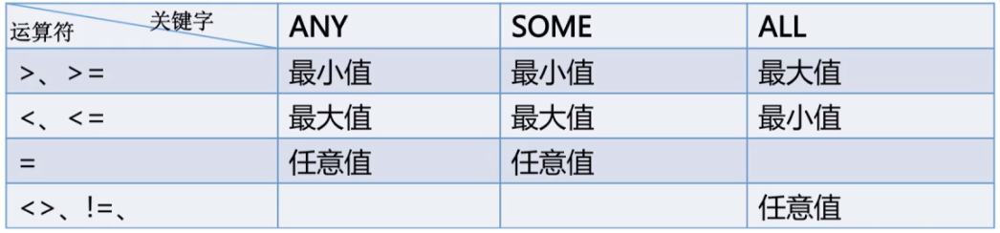

# 子查询
> 子查询(Subquery)是指出现在其他SQL语句内的SELECT子句  
> 子查询指嵌套在查询内部, 且必须始终出现在圆括号内  
> 子查询可以包含多个关键字或条件, 如DISTINCT、GROUPBY、ORDERBY、LIMIT函数等  
> 子查询的外层查询可以是:SELECT,INSERT,UPDATE,SET或DO  

### 用法
```sql
SELECT * FROM t1, 称为Outer Query / Outer Statement 
SELECT column2 FROM t2, 称为SubQuery
SELECT * FROM t1 WHERE column1 = (
    SELECT column2 FROM t2
); 
```

### SELECT引发的子查询
* 使用 **比较运算符**的子查询 **`=`** **`>`** **`<`** **`>=`** **`<=`** **`<>`** **`!=`** **`<=>`**
```sql
operand comparison_operator (subquery)
operand comparison_operator ANY (subquery)
operand comparison_operator SOME (subquery)
operand comparison_operator ALL (subquery)
```
```sql
# 大于平均值
SELECT goods_id,goods_name,goods_price FROM tdb_goods WHERE goods_price >= (
    SELECT ROUND(AVG(goods_price),2) FROM tdb_goods
);
```
```sql
# 大于子查询得到的最小值
SELECT * FROM tdb_goods WHERE goods_price > ANY (
    SELECT goods_price FROM tdb_goods WHERE goods_cate = '超级本'
);
```

* 使用 **[NOT] IN**的子查询
  * = ANY运算符与IN等效
  * != ALL或<> ALL运算符与NOT IN等效
```sql
operand comparison_operator [NOT] IN (subquery)
```
* 使用 **[NOT] EXISTS**的子查询: 如果子查询返回任何行, EXISTS将返回TRUE; 否则为FALSE

### INSERT引发的子查询
```sql
INSERT [INTO] table_name [(column_name,...)]
SELECT ...


    INSERT INTO tdb_goods_cates(cate_name)
        SELECT goods_cate FROM tdb_goods GROUP BY goods_cate
    ;
```
