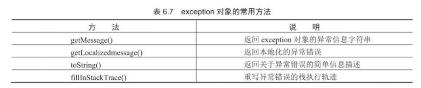

# 目录
- [指令标识](#指令标识)
    - [1. page指令](#1-page指令) `<%@ page %>`
    - [2. include指令](#2-include指令) `<%@ include %>`
    - [3. taglib指令](#3-taglib指令) `<%@ taglib %>`
- [脚本标识](#脚本标识)
    - [1. JSP表达式](#1-jsp表达式) `<%= 表达式 %>`
    - [2. 声明标识](#2-声明标识) `<%! 声明 %>`
    - [3. 代码片段](#3-代码片段) `<% 代码片段 %>`
- [动作标识](#动作标识)
    - [1. 包含文件标识\<jsp:include\>](#1-包含文件标识-jsp-include) `<jsp:include>`
    - [2. 请求转发标识\<jsp:forward\>](#2-请求转发标识-jsp-forward) `<jsp:forward>`
    - [3. 传递参数标识\<jsp:forward\>](#3-传递参数标识-jsp-forward) `<jsp:param>`
- [内置对象](#内置对象)
    - [1. request](#1-request)
    - [2. response](#2-response)
    - [3. session](#3-session)
    - [4. application](#4-application)
    - [5. out](#5-out)
    - [6. pageContent](#6-pagecontent)
    - [7. config](#7-config)
    - [8. page](#8-page)
    - [9. exception](#9-exception)


<!-- = = = = = = = = = = = = = = = = = = = = = = = = = = = = = = = = = = = = = = = = = = = = = = = = = = = = = = = = = = = = -->
<!-- = = = = = = = = = = = = = = = = = = = = = = = = = = = = = = = = = = = = = = = = = = = = = = = = = = = = = = = = = = = = -->


# 指令标识
> 指令名包括page include taglib三个指令  
```
<%@ 指令名 属性1="属性值1" 属性2="属性值2" %>
```

### 1. page指令
> page是JSP页面最常用的指令, 用于定义整个JSP页面的相关属性, 这些属性在JSP中被服务器解析成Servlet时会转换为相应的Java程序代码  

1. language属性
    > 用于设置JSP页面使用的语言, 目前只支持Java语言  
    ```jsp
    <%@ page language="java" %>
    ```
2. extends属性
    > 用于设置JSP页面继承的Java类, 所有JSP页面在执行之前都会被服务器解析成Servlet, 而ServIet是由Java类定义的, 所以JSP和ServIet都可以继承指定的父类  
3. import属性
    > 用于设置JSP导入的类包. JSP页面可以嵌入Java代码片段, 这些Java代码在调用API时需要导入相应的类包  
    ```jsp
    <%@ page import="java.util.Date"%>
    ```
4. pageEncoding属性
    > 用于定义JSP页面的编码格式, 也就是指定文件编码  
    ```jsp
    <%@ page pageEncoding="UTF-8"%>
    ```
5. contentType属性
    > 用于设置JSP页面的MIME类型和字符编码, 浏览器会据此显示网页内容  
    ```jsp
    <%@ page contentType="text/html; charset=UTF-8" %>
    ```
6. session属性
    > 指定JSP页面是否使用HTTP的session会话对象. 其属性值是boolean类型, 默认值为true, 表示可以使用session会话对象  
    ```jsp
    <%@ page session="true" %>
    ```
7. buffer属性
    > 用于设置JSP的out输出对象使用的缓冲区大小, 默认大小为8KB, 且单位只能使用KB. 建议使用8的倍数16、32、64、128等  
    ```jsp
    <%@ page buffer="128KB" %>
    ```
8. 
Flush属性
    > 用于设置JSP页面缓存满时, 是否自动刷新缓存  
    > 默认值为true, 如果设置为false, 则缓存被填满时将抛出异常  
    ```jsp
    <%@ page 
Flush="false" %>
    ```
9. isErrorPage属性
    > 可以将当前JSP页而设置成错误处理页面, 以处理另一个JSP页面的错误, 也就是异常处理  
    ```jsp
    <%@ page isErrorPage="true" %>
    ```
10. errorPage属性
    > 用于指定处理当前JSP页面异常错误的另一个JSP页面, 指定的JSP错误处理页面必须设置isErrorPage属性为true  
    > errorPage属性的属性值是一个url字符串  
    > 如果设置该属性, 那么在web.xml文件中定义的任何错误页面都将被忽略, 而优先使用该属性定义的错误处理页面  
    ```jsp
    <%@ page errorPage="error/login/ErrorPage.jsp" %>
    ```

### 2. include指令
> 文件包含指令include是JSP的另一条指令标识, 通过该指令可以在一个JSP贞面中包含另一个JSP页面  
> 该指令是**静态包含**, 也就是说被包含文件中所有内容会被原样包含到该JSP页面中, 即使被包含文件中有JSP代码, 在包含时也不会被编译执行  
> 使用include指令, 最终将生成一个文件, 所以在被包含和包含的文件中, 不能有相同名称的变量  
> 该指令只有一个file属性, 用于指定要包含文件的路径. 不可以是通过<%=%>表达式所代表的文件  
```jsp
<%@ include file="path" %>
```

### 3. taglib指令
> 通过taglib指令标识声明该页面中所使用的标签库, 同时引用标签库, 并指定标签的前缀  
> 在页面中引用标签库后, 就可以通过前缀来引用标签库中的标签  
* prefix: 用于指定标签的前缀。该前缀不能命名为jsp、jspx、java、javax、sun、servlet和sun
* uri: 用于指定标签库文件的存放位置
```jsp
<%@ taglib prefix="tagPrefix" uri="tagURI" %>
<%@ taglib prefix="c" uri="http://java.sun.com/jsp/jstl/core" %>
```


<!-- = = = = = = = = = = = = = = = = = = = = = = = = = = = = = = = = = = = = = = = = = = = = = = = = = = = = = = = = = = = = -->
<!-- = = = = = = = = = = = = = = = = = = = = = = = = = = = = = = = = = = = = = = = = = = = = = = = = = = = = = = = = = = = = -->


# 脚本标识
> 脚本标识分为三部分: JSP表达式(Expression), 声明标识(Deceleration), 脚本程序(Scriptlet)

### 1. JSP表达式
> JSP表达式用于向页面中输出信息  
> JSP表达式可以实任意的Java表达式, 该表达式的最终运算结果被转为字符串  
> JSP表达式不仅可以插入到网页文本中, 也可以插入到HTML标签内  
```
<%= 表达式 %>
```
```jsp
">

<%= 5+6 %>
```

### 2. 声明标识
> 声明标识用于在JSP页面中定义全局的变量或方法  
> 通过声明标识定义的变量和方法可以被整个JSP页面访问, 所以通常使用该标识定义整个JSP页面需要引用的变量或方法  
> 服务器执行JSP页面时, 会将JSP页面转化为Servlet类, 在该类中会把使用JSP声明标识定义的变量和方法转换为类的成员变量和方法  
```
<%! 声明的变量或方法 %>
```
```jsp
<%!
    int number = 0;
    int count() {
        number++;
        return number;
    }
%>
```

### 3. 代码片段
> 代码片段, 就是在JSP页面中嵌入的Java代码或是脚本代码  
> 代码片段将在页面请求的处理期间被执行, 通过Java代码可以定义变量或是流程控制语句等
> 而通过脚本代码可以应用JSP的内置对象在页面输出内容、处理请求和响应、访问session会话等
```
<% Java代码或是脚本代码 %> 
```
* 代码片段与声明标识的区别: 
    * 通过**声明标识**创建的变量和方法在当前JSP页面中有效, 它的生命周期是**从创建开始到服务器关闭**结束
    * **代码片段**创建的变量或方法, 也是在当前JSP页面中有效, 但它的生命周期是**页面关闭**后就会被销毁


<!-- = = = = = = = = = = = = = = = = = = = = = = = = = = = = = = = = = = = = = = = = = = = = = = = = = = = = = = = = = = = = -->
<!-- = = = = = = = = = = = = = = = = = = = = = = = = = = = = = = = = = = = = = = = = = = = = = = = = = = = = = = = = = = = = -->


# 动作标识
### 1. 包含文件标识\<jsp:include\>
> JSP的动作标识用于向当前页面中包含其他的文件  
> 被包含的文件可以是动态文件, 也可以是静态文件  

<br>
<br>

\<jsp:include\>标识对包含的动态文件和静态文件的处理方式是不同的
* 如畏被包含的是静态文件, 则页面执行后, 在使用了该标识的位置将会输出这个文件的内容
* 如果包含的是一个动态文件, 那么JSP编译器将编译并执行这个文件．\<jsp:include\>标识会识别出文件的类 型, 而不是通过文件的名称来判断该文件是静态的还是动态的

<br>
<br>

* **page**: 用于指定被包含文件的相对路径。例如, 指定属性值为top.jsp.则表示包含的是与当前JSP文件相同文件夹中的top.jsp文件包含到当前JSP页面中
* **flush**: 可选属性, 用于设置是否刷新缓冲区。默认值为false, 如果设置为true, 在当前页面输出使用了缓冲区的情况下, 先刷新缓冲区, 然后再执行包含工作
* **子动作标识\<jsp:param\>**: 用于向被包含的动态页面中传递参数
```
<jsp:include page="url" flush="true|false" />
```
```
<jsp:include page="url" flush="true|false">
    子动作标识<jsp:param>
</jsp:include>
```

<br>
<br>

include指令与文件标识\<jsp:include\>的区别
* **include指令**通过file属性指定被包含的文件, 且file属性不支持任何表达式. **文件标识\<jsp:include\>** 通过page属性指定被包含的文件, 且page属性支持JSP表达式
* 使用**include指令**时, 被包含的文件内容会原封不动地插人到包含页中, 然后JSP编译器再将合成后的文件最终编译成一个Java文件. 使用 **\<jsp:include\>** 动作标识包含文件时, 当该标识被执行时, 程序会将请求**转发**到被包含的页面, 并将执行结果输出到浏览器中, 然后返回包含页, 继续执行后面的代码. 因为服务器执行的是多个文件, 所以JSP编译器会分别对这些文件进行编译 
* **include指令**包含文件时, 由于被包含的文件最终会生成一个文件, 所以在被包含文件、包含文件中不能有重名的变量或方法. 而在使用 **\<jsp:include\>** 动作标识包含文件时, 由于每个文件是单独编泽的, 所以在被包含文件和包含文件中重名的变量和方法是不相冲突的

### 2. 请求转发标识\<jsp:forward\>
> \<jsp:forward\>动作标识可以将请求转发到其他的Web资源. 例如, 另一个JSP页面、HTML 页面、servlet等  
> 执行请求转发后, 当前页面将不再被执行, 而是去执行该标识指定的目标页面  
```
<jsp:forward page="url"/>
```
```
<jsp:forwardpage="url">
    子动作标识<jsp:param>
</jsp:forward>
```

### 3. 传递参数标识\<jsp:forward\>
> 动作标识\<jsp: param\>可以作为其他标识的子标识, 用于为其他标识传递参数
> 通过\<jsp: param\>动作标识指定的参数, 将以"参数名=值"的形式加入到请求中, 它的功能与在文件名后面直接加"? 参数名: 参数值"是相同的
```
<jsp:param name="参数名" value="参数值" />
```
通过\<jsp: param\>标识为\<jsp: param\>标识指定参数, 实现了在请求转发到modify.jsp页面的同时, 传递了参数userld,其参数值为7, 可以使用下面的代码: 
```jsp
<jsp:forward page="modify.jsp">
    <jsp:paramname="userld" value="7"/>
</jspforward>
```


<!-- = = = = = = = = = = = = = = = = = = = = = = = = = = = = = = = = = = = = = = = = = = = = = = = = = = = = = = = = = = = = -->
<!-- = = = = = = = = = = = = = = = = = = = = = = = = = = = = = = = = = = = = = = = = = = = = = = = = = = = = = = = = = = = = -->


# 内置对象
### 1. request
> request对象用于处理HTTP请求中的各项参数, 最常用的是 **获取请求参数** 

<br>
<br>

当通过超链接的形式发送请求时, 可以为该请求 **传递参数** , 这可以通过在超链接的后面加上"? "来实现. 如果要同时指定多个参数, 各参数间使用与符号"&"分隔即可  
例如, 发送一个请求到delete.jsp页面, 并传递一个名称为id的参数  
```html
<a href="delete.jsp?id=l">删除</a> 
```
在delete.jsp页面中, 可以通过request对象的getParameter()方法获取传递的参数值
```jsp
<%
request.getParameter("id");
%>
```

<br>
<br>

在进行请求转发时, 需要把一些数据传递到转发后的页面进行处理。这时, 就需要使用request对象的`setAttribute()`方法将数据保存到request范围内的变量中。 
```
request.setAttribute(String name, Object object);
```
在将数据保存到request范围内的变量中后, 可以通过request对象的getAttribute()方法获取该变量的值
```
request.getAttribute(String name);
```

<br>
<br>


* request对象的 **`getookies()`** 方法可获取到所有cookie对象的集合
* cookie对象的 **`getName()`** 方法可以获取到指定名称的cookie
* cookie对象的 **`getValue()`** 方法可获取到cookie对象的值
* response对象的 **`addCookie()`** 方法将一个cookie对象发送到客户端


### 2. response
> respondse对象用于响应客户请求, 向客户端输出信息

<br>
<br>

* 重定向  
response对象的`sendRedirect()`方法可以将网页重定向到另一个页面。与转发不同的是, 重定向操作支持将 地址重定向到不同的主机上。进行重定向操作后, request中的属性全部失效, 并且开始一个新的request对象
```java
response.sendRedirect(String path);
```

<br>
<br>

* 处理HTTP文件头  
通过response对象可以设置HTTP响应报头, 其中, 最常用的是禁用缓存、设置页面自动刷新和定时跳转网页
```java
// 禁用缓存
response.setHeader("Cache-Control","no-store");
response.setDateHeader("Expires",0); 
```
```java
// 每隔10秒自动刷新一次
response.setHeader("refresh","10");
```
```java
// 5秒钟后自动跳转到指定的网页 
response.setHeader("refresh", "5;URL=Iogin.jsp");
```

<br>
<br>

* 设置输出缓冲  
通常情况下, 服务器要输出到客户端的内容不会直接写到客户端, 而是先写到一个输出缓冲区, 当满足以下3种情况之一, 就会把缓冲区的内容写到客户端。
    * JSP页而的输出信息己经全部写入到了缓冲区
    * 缓冲区己满
    * 在JSP页面中, 调用了对象的flushBuffer()方法或out对象的flush()方法  


### 3. session
> 通过session可以存储或读取客户相关的信息

<br>

* 创建及获取会话
```java
session.setAttribute(String name, Object obj);
```
```java
session.getAttribute(String name);
```
* 从会话删除对象
```java
session.removeAttribute(String name);
```
* 销毁对话
```java
session.invalidate();
```
* 会话超时管理
```java
// 返回客户端最后一次与会话相关联的请求时间
session.getLastAccessedTime()
// 以秒为单位返回一个会话内两个请求最大时间间隔
session.getMaxInactivelnterval()
// 以秒为单位设置session的有效时间
session.setMaxInactiveIntervaI()
```

### 4. application
> applicauon对象用于保存所有应用程序中的公有数据  
> 它在服务器启动时自动创建，在服务器停止时销毁  

<br>

* 访问应用程序初始化参数
application对象提供了对应用程序初始化参数进行访问的方法  
应用程序初始化参数在web.xml文件中进行设置，web.xml文件位于Web应用所在目录下的WEB-INF子目录中。在webxml文件中通过\<context\-param\>标记配置应用程序初始化参数  
```xml
<!-- 在web.xml文件中配置连接MySQL数据库所需的url参数  -->
<context-param>
    <param-name>url</param-name>
    <param-value>jdbc:mysql://127.O.O.1．3306／dbdatabase</param-value>
</context-param>
```
```java
// 返回己命名的参数值
application.getlnitParameter(String name);

// 获取上述web.xml配置中url参数的值
application.getlnitParameter("url");
```
```java
// 返回所有已定义的初始化参数名
application.getAttributeNames();
```

### 5. out
> 用于在web浏览器内输出信息, 并管理服务器上的输出缓冲区

* 输出信息
```java
out.print();
out.printl();
```


### 6. pageContent
> 通过它可以过去JSP页面的request, response, session, application等对象  


### 7. config
> 用于取得服务器的配置信息  


### 8. page
> page对象代表JSP本身  


### 9. exception
> exception对象用来处理JSP文件执行时发生的所 有错误和异常，只有在page指令中设置isErrorPage属 性值为true的页面中才可以被使用  


